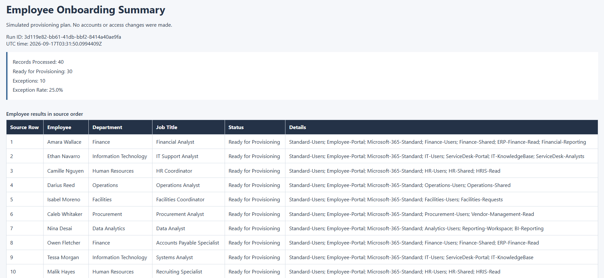
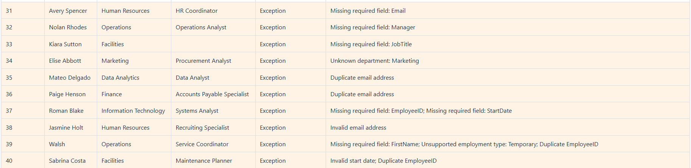

# Employee Onboarding & Access Automation

## Overview

I built a PowerShell workflow that simulates an HR-to-IT employee onboarding process. It reads employee intake data, validates each record, applies department and job-title access rules, and flags exceptions. It then creates a provisioning plan, an audit log, and an HTML summary.

All employees, groups, and access assignments are fictional. The script does not connect to Active Directory, Microsoft Entra ID, or any production system.

## Why I Built It

I wanted hands-on practice with PowerShell, process automation, input validation, exception handling, access-control logic, and structured logging using a common IT workflow.

## How It Works

HR intake CSV → validation → access-rule lookup → provisioning plan → audit log → HTML summary

Valid records receive a proposed access assignment and the status `Ready for Provisioning`. Invalid records are logged as `Exception` with a reason while the rest of the batch continues.

## Project Structure

```text
employee-onboarding-powershell/
├── .gitignore
├── README.md
├── config/
│   └── access_rules.json
├── data/
│   └── new_hires.csv
├── docs/
│   ├── ProjectRequirements.md
│   ├── TestCases.md
│   └── ProcessFlow.md
├── scripts/
│   └── Invoke-EmployeeOnboarding.ps1
├── screenshots/
│   ├── onboarding-summary.png
│   └── onboarding-exceptions.png
└── output/
    ├── ProvisioningPlan.csv
    ├── AuditLog.json
    └── OnboardingSummary.html
```

## Validation

The script checks required fields, allowed departments, supported employment types, email format, duplicate email addresses and employee IDs, and valid start dates in `yyyy-MM-dd` format. It also validates CSV headers and structure and the access-rule configuration.

Values are trimmed before validation. Every record sharing a duplicate ID or email becomes an exception, including the first occurrence. Exceptions receive no access groups.

## Access Rules

Assignments come from [config/access_rules.json](config/access_rules.json). Valid employees receive standard access, department access, and job-title access where a rule matches both the department and title.

For example, an IT Support Analyst receives the standard package, IT department groups, and `ServiceDesk-Analysts`. IT employment does not grant administrator access. These are proposed assignments; no accounts or groups are created.

## Error Handling

Records are processed independently with `try/catch`. A bad record becomes an `Exception` with a specific reason and does not stop later records. Unexpected record errors are logged as `Processing error` with no access assigned.

Input or configuration errors stop the run and leave earlier reports unchanged. Reports are written to temporary files before replacement. An output error warns that reports may be stale or incomplete.

## Example Results

The supplied dataset produced these verified results:

| Result | Count |
| --- | ---: |
| Records processed | 40 |
| Ready for Provisioning | 30 |
| Exceptions | 10 |
| Exception rate | 25% |

The dataset intentionally includes invalid records to test exception handling. The exception rate describes this test file, not business performance.

## Sample Report

The [HTML summary](output/OnboardingSummary.html) contains batch totals, proposed groups, and exception reasons. Download it and open it in a browser to view the report. The [provisioning plan](output/ProvisioningPlan.csv) and [audit log](output/AuditLog.json) contain the same 40 results in CSV and JSON form.

The audit log includes UTC timestamps, a run ID, the rules applied, and the configuration version and hash.





These screenshots show an earlier completed run of the same dataset. Run IDs and timestamps change each time the script runs.

## Running the Project

Use PowerShell 7 from the repository root:

```powershell
pwsh -NoProfile -File .\scripts\Invoke-EmployeeOnboarding.ps1 -CsvPath .\data\new_hires.csv
```

The script creates `output/` if needed and writes all three reports there. Relative CSV paths resolve from your current working directory; configuration and output paths resolve from the repository.

Exit code `2` means the batch completed with exceptions, which is expected for the supplied dataset. Exit code `0` means all records are ready, and `1` means an input, configuration, or output failure.

No administrator rights, external modules, or service connections are required. The script does not change execution policy.

## Testing

The completed checks are documented in [docs/TestCases.md](docs/TestCases.md):

- All 40 records were processed: 30 valid and 10 exceptions, with the documented reasons matching exactly.
- Duplicate detection flagged both members of each pair, including case and whitespace variations.
- An injected processing error did not stop later records.
- JSON parsed successfully, and the CSV was re-imported with 40 rows and the expected headers.
- Repeated runs replaced the reports without manual cleanup. Relative paths and missing output directory creation also passed.
- PowerShell 7.6.5 direct execution passed. Validation and failure tests also passed in Windows PowerShell 5.1.

HTML totals, row contents, and escaping were checked. Screenshots of the rendered report were visually reviewed, including the summary, successful records, and all ten exception rows.

## Skills Practiced

PowerShell, CSV processing, JSON, input validation, error handling, role-based access concepts, structured logging, process automation, Git, and GitHub.

## Limitations

- This is a local simulation. No real Active Directory or Entra accounts are created, and all access groups are fictional.
- Duplicate checks apply only to the current batch.
- Output files are replaced on each completed run. There is no historical audit store.
- Manager identity, email ownership, and actual access are not verified.
- Titles without a matching rule receive only standard and department access.

## Future Improvements

- Add an approval step with Power Automate.
- Replace CSV intake with a Power Apps or SharePoint form.
- Keep historical run logs for comparison and reporting.
- Explore provisioning separately in a controlled Active Directory or Microsoft Entra lab.
